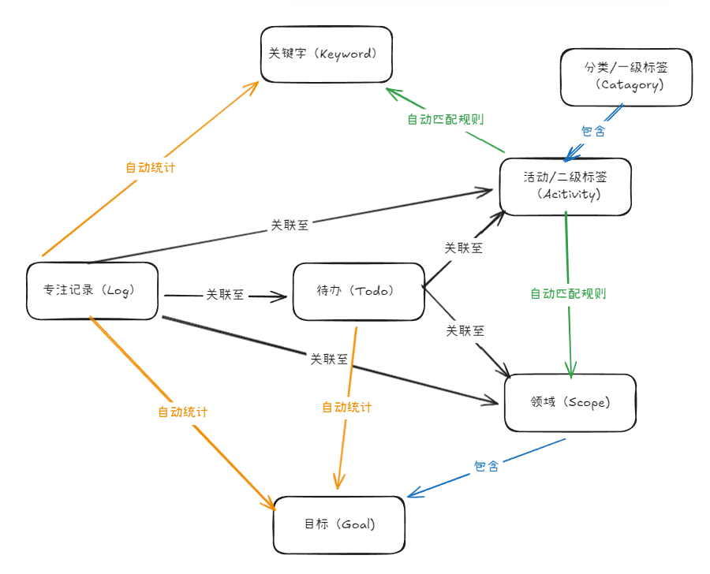

# LumosTime 🌟

LumosTime 是一款专注于个人成长与生活记录的全能时间管理应用。它融合了**时间追踪**、**待办管理**、**每日回顾**、**领域目标 (Scope & Goals)**、**数据统计**以及**WebDAV 云同步**等功能，旨在通过精美的 UI 设计和流畅的交互体验，帮助用户将被动的时间流逝转化为主动的生命积累。

支持 **Web** 、 **Windows** 与 **Android** 原生应用。

🌐 **在线预览**: [lumostime2.vercel.app](https://lumostime2.vercel.app)

📖 **用户指南** - 详细的功能使用说明：
- [时间记录方法论](./docs/user-guide/00-time-tracking-methods.md) - 为什么要记录时间？柳比歇夫时间统计法与间歇日志
- [开始记录你的时间](./docs/user-guide/01-getting-started.md) - 五种记录方式：点击即录、手动补录、AI 补记、快速打点、NFC 一触即录
- [待办管理](./docs/user-guide/02-todo-management.md) - 项目日志式的待办系统，进度追踪与任务关联
- [标签管理](./docs/user-guide/03-tags-management.md) - 二级分类结构、关键字功能、自动关联规则
- [领域与目标](./docs/user-guide/04-scope-and-goals.md) - 跨分类的宏观视角，5 种目标类型
- [数据统计](./docs/user-guide/05-data-statistics.md) - 5 种统计视图、专项分析、报告导出
- [回顾与复盘](./docs/user-guide/06-daily-review.md) - 日课打卡、数据统计、引导复盘、AI 叙事
- [搜索与数据管理](./docs/user-guide/07-search.md) - 全局搜索、自定义筛选器、批量管理
- [数据同步与导出](./docs/user-guide/08-data-sync.md) - WebDAV/S3 同步、JSON/Excel/Obsidian 导出
- [个性化设置](./docs/user-guide/09-personalization.md) - 主题方案、时间小友、自定义图标

## ✨ 核心功能

### 1. ⏱️ 沉浸式时间记录 (Time Tracking)
- **五种记录方式**：
  - **点击即录**：点击活动图标开始计时，悬浮球显示进度
  - **手动补录**：时间块拖拽交互，精确调整时间段
  - **AI 智能补记**：自然语言输入（如"上午看书两小时"），AI 自动解析生成记录
  - **快速打点**：一键标记当前时刻，事后补充详情
  - **NFC 一触即录**：(Android) 手机触碰 NFC 标签自动开始/结束计时
- **多任务并行**：支持同时开始多个专注会话，灵活应对复杂场景
- **悬浮计时球**：全局悬浮窗实时显示当前进行中的活动，支持快速结束
- **专注度评分**：记录结束时可对本次专注质量进行 1-5 分打分

### 2. 🎯 领域与目标系统 (Scope & Goals)
- **正交维度管理**：引入 **"Scope (领域)"** 概念，提供跨分类的宏观视角
- **关键字功能**：为领域添加关键字，支持关键字热力图可视化
- **交叉分析**：查看领域关联的待办和标签，分析时间分布
- **目标追踪**：
  - 支持设定特定时间段的目标
  - **5 种目标类型**：时长、有效时长、任务数量、活跃天数、时长上限
  - **自动进度**：目标与 Scope 关联，自动统计相关记录积累进度

### 3. 📝 深度待办管理 (Advanced Todo)
- **任务关联**：将待办事项与活动标签关联，实现"做任务即记录时间"
- **墨水进度格 (Ink Grid)**：针对长周期任务的可视化进度条
- **批量管理**：高效的批量编辑视图，支持多选归档、移动分类
- **快捷操作**：左滑完成任务，右滑复制任务

### 4. 📊 多维数据统计 (Analytics)
- **5 种统计视图**：
  - **饼图**：清晰展示时间分配比例（日/周/月/年）
  - **矩阵视图**：周度活动打卡概览
  - **折线图**：时间投入趋势变化（周/月）
  - **日程视图**：可视化的一日/一周/一月时间轴
  - **日课打卡视图**：追踪每日习惯打卡情况
- **专项分析**：
  - 热力图、画廊视图、关键字分析
  - 专注统计条形图、交叉分析
- **报告导出**：导出统计摘要和日报

### 5. 🔍 全局搜索与自定义筛选 (Search & Filter)
- **跨类型搜索**：同时搜索活动标签、待办事项、领域、时间记录、回顾
- **一键跳转**：直接进入详情页
- **自定义筛选器**：使用特殊语法创建复杂查询规则
  - 支持标签 (#)、领域 (%)、待办 (@)、备注全文搜索
  - 支持逻辑与/或组合，灵活筛选数据
  - 多维度分析：时间线、节奏分布、趋势图、专注度统计
- **批量管理记录**：基于筛选器批量操作时间记录
  - 批量添加/移除/替换领域
  - 批量关联/取消待办
  - 批量更改活动标签

### 6. 🏷️ 灵活标签系统 (Tag System)
- **二级分类结构**：Category（大分类） -> Activity（具体活动）
- **关键字标记**：为活动添加关键字，支持关键字热力图可视化。并通过关键字，建立关联规则，实现快速标签选择。
- **自定义主题**：每个分类可独立设置主题色
- **自动关联规则**：设置活动与领域的自动关联

### 7. 📝 AI 叙事与每日回顾 (AI Journal & Review)
- **四维回顾体系**：
  - **日课 (Check)**：每日习惯打卡，支持模板导入与统计汇总
  - **数据 (Stats)**：可视化时间统计，多种图表展示
  - **引导 (Guide)**：结构化复盘模板，支持问答题、选择题、评分题
  - **叙事 (Narrative)**：AI 共创深度日志
- **9 种 AI 叙事模板**：
  - 赛博黄历、哲学命题、每日简报、极简复盘
  - 严格导师、正念叙事、成长教练、苏维埃、树洞伴侣
- **个性化 AI 设置**：自定义画像和提示词，让 AI 更懂你
- **往年今日**：在时间轴上重现"去年今日"的足迹，连接过去与现在

### 8. ☁️ 数据同步与导出 (Data Sync & Export)
- **多种同步方式**：
  - **WebDAV 同步**：支持坚果云、Nextcloud 等，多端数据自动同步
  - **S3 同步**：支持腾讯云对象存储（COS）
- **全量备份**：同步范围覆盖日志、待办、设置、AI提示词及每日回顾数据
- **多格式导出**：
  - **JSON 导出**：完整数据备份与恢复
  - **Excel 导出**：按日期范围导出时间记录
  - **Obsidian 导出**：将时间记录和回顾导出为 Markdown 文件，支持自定义路径模板
- **自动同步**：后台自动同步与启动时自动拉取
- **本地优先**：所有数据优先存储于本地

### 9 🎨 个性化主题 (Personalization)
- **主题方案**：一键应用预设主题，包含 UI 主题、配色、背景、装饰等
- **时间小友**：可爱的陪伴角色，增添记录趣味
- **自定义背景**：更换导航栏背景图片和装饰
- **应用图标**：更换桌面启动器图标样式
- **UI 图标主题**：12 种图标风格，统一更换标签图标样式


### 🧩 核心数据模型 (Data Model)

下图展示了 LumosTime 中各个数据实体之间的关联关系与自动化流转逻辑：



- **核心实体**：
  - **Category/Activity**: 基础分类体系，Activity 是 Category 的子集。
  - **Log (专注记录)**: 最小时间单元，承载实际投入。
  - **Todo (待办)**: 具体的任务项，可作为记录时间的入口。
- **聚合维度**：
  - **Scope (领域)**: 跨分类的聚合维度（如"输出"、"英语"）。
  - **Goal (目标)**: 基于 Scope 设定的量化指标。
  - **Keyword (关键字)**: 用于文本分析的细粒度标记。
- **流转逻辑**：
  - **关联 (Link)**: 实体间的直接引用（如 Log 关联 Todo）。
  - **自动匹配 (Auto Match)**: 基于预设规则，Activity 可自动关联 Scope 或 Keyword。
  - **自动统计 (Auto Count)**: Log 的时长和 Todo 的完成数会自动汇总到 Goal 和 Keyword 统计中。


## 🛠️ 技术栈

- **核心框架**: [React 19](https://react.dev/)
- **构建工具**: [Vite](https://vitejs.dev/)
- **移动端运行时**: [Capacitor 7](https://capacitorjs.com/) (Android)
- **语言**: [TypeScript](https://www.typescriptlang.org/)
- **样式**: [Tailwind CSS](https://tailwindcss.com/)
- **图标库**: [Lucide React](https://lucide.dev/)
- **数据同步**: [WebDAV Client](https://github.com/perry-mitchell/webdav-client)

## 📂 项目结构

```
├── components/      # 通用 UI 组件
│   ├── AddLogModal.tsx      # 添加/编辑时间记录
│   ├── TodoDetailModal.tsx  # 待办详情与进度追踪
│   ├── GoalEditor.tsx       # 目标编辑器
│   ├── CalendarWidget.tsx   # 日历热力图组件
│   ├── FocusCharts.tsx      # 专注度图表
│   └── TimerFloating.tsx    # 悬浮计时球
├── views/           # 主要页面视图
│   ├── RecordView.tsx       # 首页记录视图
│   ├── TimelineView.tsx     # 时间轴与日志管理
│   ├── DailyReviewView.tsx  # 每日回顾与 AI 叙事
│   ├── StatsView.tsx        # 统计分析
│   ├── TodoView.tsx         # 待办事项列表
│   ├── ScopeView.tsx        # 领域概览
│   ├── ScopeDetailView.tsx  # 领域详情与目标
│   ├── TagDetailView.tsx    # 标签详情页
│   ├── ReviewTemplateManageView.tsx # 回顾模板管理
│   ├── SearchView.tsx       # 全局搜索
│   └── SettingsView.tsx     # 设置与数据管理
├── services/        # 核心服务逻辑
│   ├── webdavService.ts     # WebDAV 数据同步
│   ├── aiService.ts         # AI 服务
│   └── narrativeService.ts  # 叙事生成逻辑
├── android/         # Android 原生工程目录
├── App.tsx          # 应用入口
├── types.ts         # TypeScript 类型定义
└── constants.ts     # 全局常量与预设数据
```

## 🚀 快速开始

### 开发环境准备

1. **Node.js**: 确保已安装 Node.js 18+
2. **Android Studio**: (仅移动端开发需要)

### 安装与运行

```bash
# 安装依赖
npm install

# 启动开发服务器
npm run dev
```

### 📱 Android 应用打包

```bash
# 1. 构建 Web 资源
npm run build

# 2. 同步到 Android 项目
npx cap sync android

# 3. 打开 Android Studio
npx cap open android
```

在 Android Studio 中：
- **调试版**：Build → Build APK(s)
- **发布版**：Build → Generate Signed Bundle / APK

### 💻 Electron 桌面端

开发模式下，`npm run dev` 会同时启动 Web 服务和 Electron 窗口。

打包生产环境安装包：

```bash
# 构建 Windows 安装包 (默认配置)
npm run electron:build
```

构建产物位于 `release/` 目录下。

### 🌐 Vercel 部署

本项目支持一键部署到 Vercel。

```bash
# 安装 Vercel CLI
npm install -g vercel

# 部署
vercel
```

> ⚠️ 注意：Web 端的 WebDAV 云同步功能可能受到 CORS 限制


## 📄 License

[GNU General Public License v3.0](LICENSE)

---

*LumosTime - Illuminate your time, illuminate your life.* ✨
